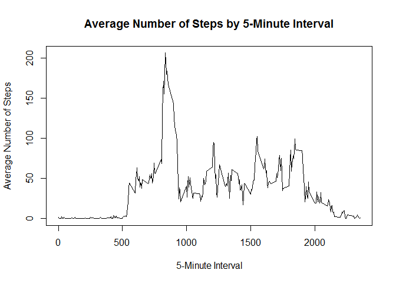

# Reproducible Research: Peer Assessment 1


## Loading and preprocessing the data


I previously set the work directory but did not display the location for privacy reasons. I then loaded the activity data into R. 

```r
activity  <- read.csv("activity.csv")
```

The summary shows that there are 17568 observations and 3 variables in the data, which is in line with expectations. 

The summary of the date field shows that the data covers the 61-day period from the 1st of October 2012 to the 30th of November 2012. 


```r
str(activity)
```

```
## 'data.frame':	17568 obs. of  3 variables:
##  $ steps   : int  NA NA NA NA NA NA NA NA NA NA ...
##  $ date    : Factor w/ 61 levels "2012-10-01","2012-10-02",..: 1 1 1 1 1 1 1 1 1 1 ...
##  $ interval: int  0 5 10 15 20 25 30 35 40 45 ...
```

```r
summary(as.POSIXlt(activity$date))
```

```
##                  Min.               1st Qu.                Median 
## "2012-10-01 00:00:00" "2012-10-16 00:00:00" "2012-10-31 00:00:00" 
##                  Mean               3rd Qu.                  Max. 
## "2012-10-31 00:06:53" "2012-11-15 00:00:00" "2012-11-30 00:00:00"
```

I produced two datasets summarising the steps: one with the total steps by day, and one with the average steps by 5-minute interval.  


```r
activity.daySum <- sapply(split(activity, activity$date), function(x) sum(x[, c("steps")], na.rm=TRUE))
activity.5minuteMean <- sapply(split(activity, activity$interval), function(x) mean(x[, c("steps")], na.rm=TRUE))
```


## What is mean total number of steps taken per day?
Producing a histogram of number of steps taken each day shows some skewness in the distribution, towards lower values. From the summary statistics we can see that the mean number of steps taken per day was 9354, and the median number of steps taken over the observation period was 10400. 

```r
hist(activity.daySum)
```

 

```r
summary(activity.daySum)
```

```
##    Min. 1st Qu.  Median    Mean 3rd Qu.    Max. 
##       0    6778   10400    9354   12810   21190
```

## What is the average daily activity pattern?
The time series shows that the user tends to wake up around 6am, with most of their walking activity in the morning from 8-10am. There are various spikes throughout the day, with the user going to sleep around 10:30pm. On average the user takes the most steps during the 8:35am interval. 


```r
plot(x=names(activity.5minuteMean), y=activity.5minuteMean,type="l" 
     , main="Average Number of Steps by 5-Minute Interval"
     , xlab = "5-Minute Interval", ylab = "Average Number of Steps")
```

 

```r
which.max(activity.5minuteMean)
```

```
## 835 
## 104
```


## Imputing missing values
The presence of missing values in the data may bias the results. From the 17568 5-minute time intervals, 2304 have missing values. I have chosen to impute these missing values using the average value for the 5-minute interval and created a new dataset called activityNew. Comparing the new and old datasets shows the imputation has worked as expected.


```r
sum(is.na(activity$steps))
```

```
## [1] 2304
```

```r
meanImputed <- rep.int(activity.5minuteMean, 61)
activityNew <- activity
activityNew$steps[is.na(activityNew$steps)] <- meanImputed[is.na(activityNew$steps)]

head(activity)
```

```
##   steps       date interval
## 1    NA 2012-10-01        0
## 2    NA 2012-10-01        5
## 3    NA 2012-10-01       10
## 4    NA 2012-10-01       15
## 5    NA 2012-10-01       20
## 6    NA 2012-10-01       25
```

```r
head(activityNew)
```

```
##       steps       date interval
## 1 1.7169811 2012-10-01        0
## 2 0.3396226 2012-10-01        5
## 3 0.1320755 2012-10-01       10
## 4 0.1509434 2012-10-01       15
## 5 0.0754717 2012-10-01       20
## 6 2.0943396 2012-10-01       25
```

Producing a new histogram with the imputed data shows that the distribution of steps taken per day looks more like a normal distribution, with less skewness than the original histogram. In the new distribution, the mean and median steps per day are now 10770, which are both larger than the original mean of 9354 and original median of 10400. The use of imputation has probably made the results more in line with the user's actual walking activity.   

```r
activityNew.daySum <- sapply(split(activityNew, activityNew$date), function(x) sum(x[, c("steps")], na.rm=TRUE))
hist(activityNew.daySum)
```

 

```r
summary(activityNew.daySum)
```

```
##    Min. 1st Qu.  Median    Mean 3rd Qu.    Max. 
##      41    9819   10770   10770   12810   21190
```

```r
summary(activity.daySum)
```

```
##    Min. 1st Qu.  Median    Mean 3rd Qu.    Max. 
##       0    6778   10400    9354   12810   21190
```

## Are there differences in activity patterns between weekdays and         weekends?

I created the field "daytype" which stores whether each day is a weekday or weekend. Comparing the average steps by weekend/weekday in the panel plot shows that on weekdays the user usually wakes up earlier, and has less activity in the middle of the day. In contrast, on weekends, the user wakes up later and has more activity during the day. 

```r
weekendFlag <- (weekdays(as.POSIXlt(activityNew$date)) %in% c("Saturday", "Sunday"))
recode <- c(weekend = TRUE, weekday = FALSE)            
activityNew$daytype <- factor(weekendFlag, levels=recode, labels=names(recode))
activityNew[c(1:5, 1800:1805),]
```

```
##           steps       date interval daytype
## 1     1.7169811 2012-10-01        0 weekday
## 2     0.3396226 2012-10-01        5 weekday
## 3     0.1320755 2012-10-01       10 weekday
## 4     0.1509434 2012-10-01       15 weekday
## 5     0.0754717 2012-10-01       20 weekday
## 1800  0.0000000 2012-10-07      555 weekend
## 1801  0.0000000 2012-10-07      600 weekend
## 1802  0.0000000 2012-10-07      605 weekend
## 1803  0.0000000 2012-10-07      610 weekend
## 1804 34.0000000 2012-10-07      615 weekend
## 1805 13.0000000 2012-10-07      620 weekend
```

```r
weekend = subset(activityNew,daytype == "weekend") 
weekday = subset(activityNew,daytype == "weekday") 
        
weekend.5minuteMean <- sapply(split(weekend, weekend$interval), function(x) mean(x[, c("steps")], na.rm=TRUE))
weekday.5minuteMean <- sapply(split(weekday, weekday$interval), function(x) mean(x[, c("steps")], na.rm=TRUE))

plotdata <- rbind(data.frame(interval = as.integer(names(weekend.5minuteMean)), 
                             steps = weekend.5minuteMean, daytype = "Weekend"), 
                  data.frame(interval = as.integer(names(weekday.5minuteMean)), 
                             steps = weekday.5minuteMean, daytype = "Weekday"))


library(lattice)
xyplot(steps ~ interval | daytype, data = plotdata 
       ,type = "l", layout=c(1,2)
       ,xlab = "Interval", ylab = "Number of Steps"
       , main = "Average Number of Steps by interval on Weekdays/Weekends")
```

 
